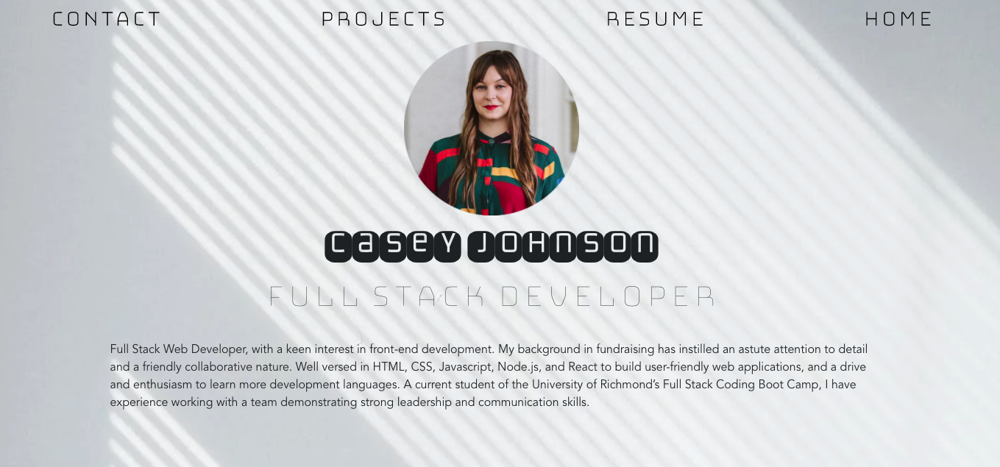
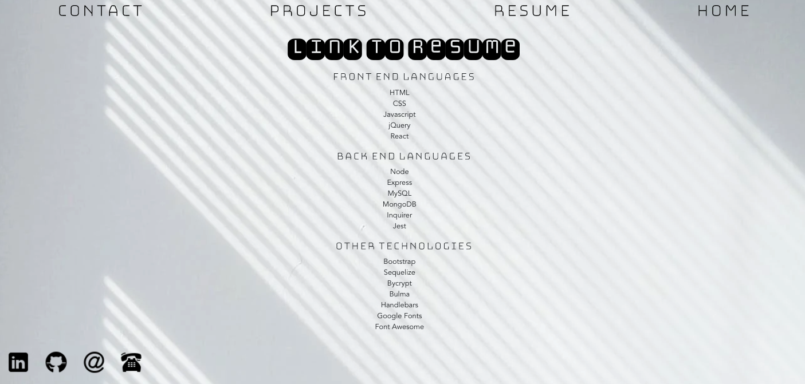
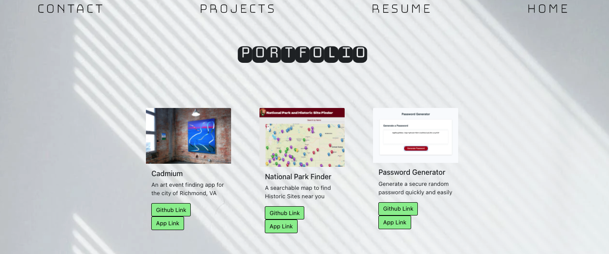
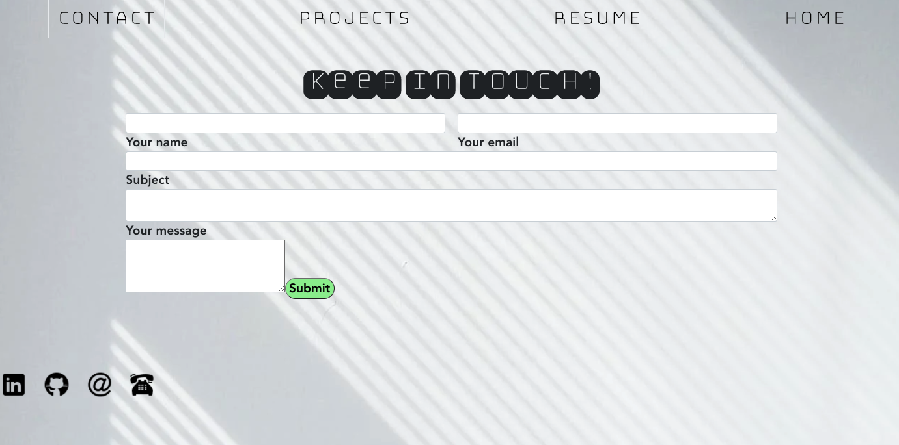

# cj-react-portfolio


[Link to Portfolio Website](https://johnsoncm.github.io/cj-react-portfolio/)<br>


**Website Behavior**<br>
When the links in the navbar are clicked, the user is taken to those pages. When the user clicks the 'Resume' link, they are taken to a pdf of my resume. On the Projects page, there are links to both the deployed link and the github repo link, as well as an image and brief description of the app. The Contact page contains a contact form. The functionality of this form has not been implemented yet. In the footer, my LinkedIn and Github profiles are linked, as well as my email and phone number.

****
****
****
****


**Technologies Used:**<br>
  ```

  React
  HTML
  CSS
  Bootstrap
  Google Fonts
```

**Contact Info:**<br>
Casey Johnson<br>
johnsoncm3@gmail.com<br>
[Github Profile](https://github.com/johnsoncm)<br>


